# MindNest

**A calmer space for your mind.** MindNest is a Flutter app that connects people seeking mental-health support with verified professionals: mood tracking, private journaling, therapist discovery and booking, secure chat, and a full practice-management side for therapists. Firebase is the backend.

<p align="center">
  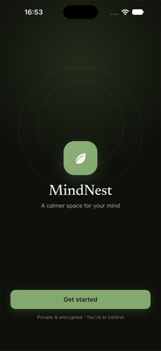
  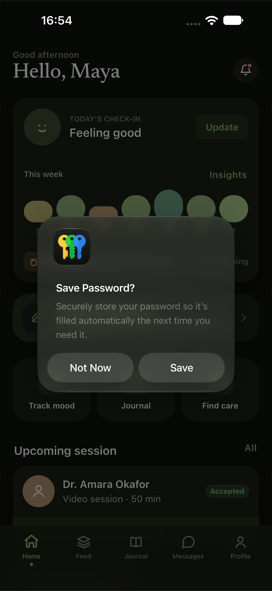
  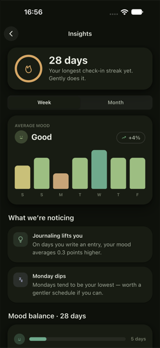
  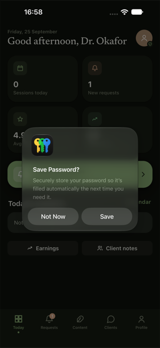
</p>

## Features

### For clients

| Home | Mood check-in | Insights | Journal |
|:--:|:--:|:--:|:--:|
|  | 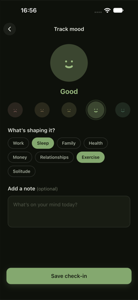 |  | 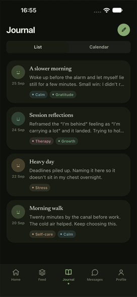 |
| Daily check-in, weekly mood strip, streaks and your next session | Log how you feel and what's shaping it | Trends, streaks and patterns calculated from your own data | Private reflections with moods and tags |

| Find a therapist | Therapist profile | Booking | Your sessions |
|:--:|:--:|:--:|:--:|
| 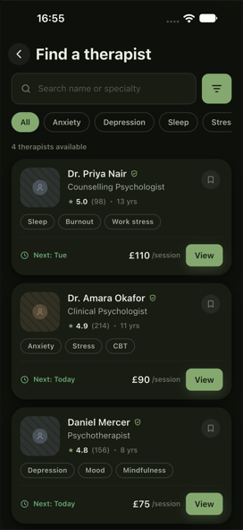 |  | 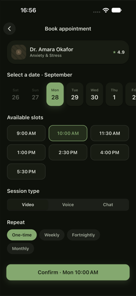 | 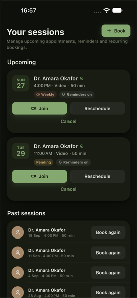 |
| Search and filter verified professionals | Credentials, specialties and pricing | Live availability; a slot can't be double-booked | Upcoming, recurring and past sessions |

| Messages | Spaces (feed) | Notifications | Profile |
|:--:|:--:|:--:|:--:|
| 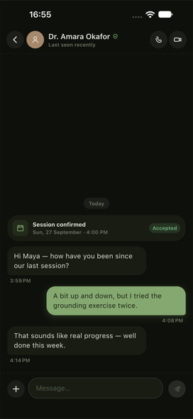 | 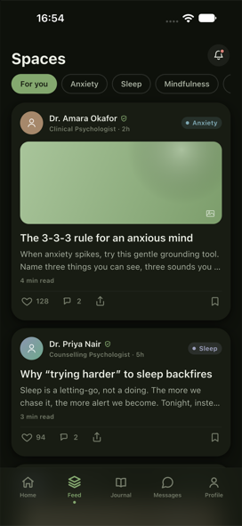 | 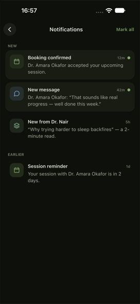 | 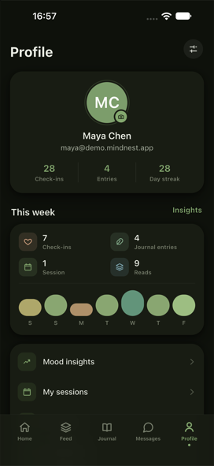 |
| Real-time chat with read receipts and the confirmed session pinned | Articles from professionals: like, save, comment | Live in-app inbox plus push notifications | Your stats at a glance |

### For professionals

| Dashboard | Booking requests | Client record | Earnings |
|:--:|:--:|:--:|:--:|
|  | 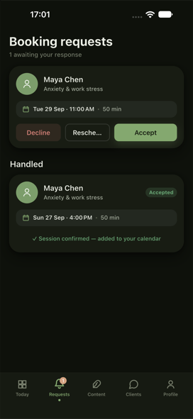 | 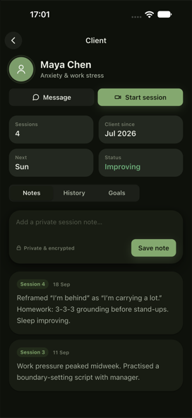 | 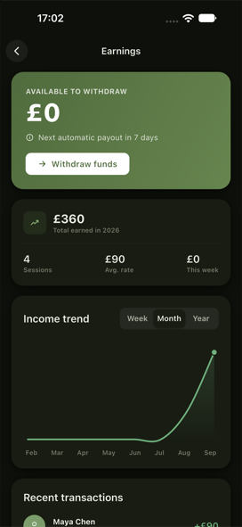 |
| Today's sessions, requests and practice metrics | Accept or decline; accepting opens a chat thread | Private notes, goals and session history | Income calculated from completed sessions |

Professionals also get a weekly calendar, content publishing, and a credential verification flow. Nobody appears in the directory until an admin approves them.

### Onboarding

| Welcome | Choose your path | Sign in |
|:--:|:--:|:--:|
|  | 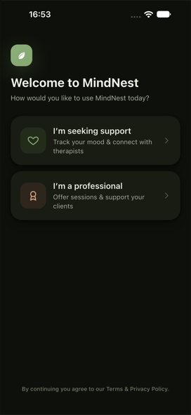 | 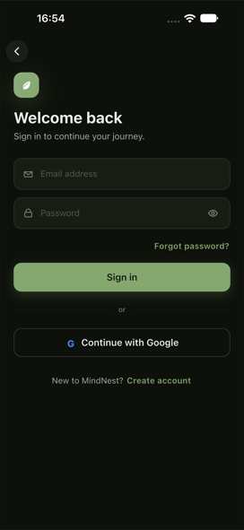 |

Sign in with email and password (with email verification) or Google. Clients complete a short wellbeing questionnaire; professionals submit credentials.

## Tech stack

- **Flutter**, feature-first clean architecture (`data` / `domain` / `presentation` per feature)
- **State management:** `flutter_bloc`, with `freezed` states and events
- **Dependency injection:** `get_it` + `injectable`
- **Navigation:** `auto_route` with auth guards
- **Backend:** Firebase Auth, Cloud Firestore and Cloud Messaging
- Adaptive phone and tablet layouts, light and dark themes, and in-app accessibility controls

```
lib/
  core/        DI, routing, theme, widgets, Firebase helpers, push
  features/    auth · chat · feed · home · journal · mood · notifications ·
               onboarding · practice · profile · sessions · settings ·
               shell · therapists
firestore.rules            security rules (the enforcement layer)
firestore.indexes.json
tool/firebase/             rules tests, seed & admin scripts
```

## Getting started

```bash
flutter pub get
dart run build_runner build --delete-conflicting-outputs
```

### Run against local emulators (recommended for development)

No Firebase project setup needed:

```bash
firebase emulators:start --only auth,firestore
```

In a second terminal, seed the demo data:

```bash
cd tool/firebase && npm install
FIRESTORE_EMULATOR_HOST=127.0.0.1:8080 FIREBASE_AUTH_EMULATOR_HOST=127.0.0.1:9099 node seed.mjs --demo-client
```

Then run the app:

```bash
flutter run --dart-define=USE_FIREBASE_EMULATOR=true
```

Demo logins (password `MindNest-demo-1`):

| Role | Email |
|---|---|
| Client | `maya@demo.mindnest.app` |
| Professional | `amara@demo.mindnest.app` (also `daniel@`, `priya@`, `sofia@`) |

### Run against your Firebase project

1. Configure the project with `flutterfire configure`.
2. Enable **Email/Password** and **Google** sign-in in the Firebase console. For Google sign-in on Android, add your SHA-1 fingerprint.
3. Deploy the rules and indexes:
   ```bash
   firebase deploy --only firestore
   ```
4. Optionally seed demo content. Save a service-account key as `tool/firebase/service-account.json` (it's git-ignored), then:
   ```bash
   cd tool/firebase && npm run seed
   ```
5. Approve a professional after they sign up:
   ```bash
   cd tool/firebase && npm run approve -- someone@example.com
   ```

## Security

The app works on the Firebase Spark plan with no server code, so **`firestore.rules` is the security boundary**. The rules cover:

- Owner-only access to profiles, moods, journal entries and notes
- Legal state transitions: clients can only cancel, professionals can only accept or decline, and nobody can verify themselves
- Slot locks that prevent double-booking
- Like counters paired with per-user marker docs, so counts can't be forged

The rules have their own test suite, which runs on the emulator:

```bash
cd tool/firebase && npm run test:rules
```

## Push notifications

Device tokens are stored per user, and pushes are shown while the app is running. To deliver pushes when the app is closed, deploy the ready-made Cloud Function in `tool/firebase/blaze_functions/` (requires the Blaze plan).
